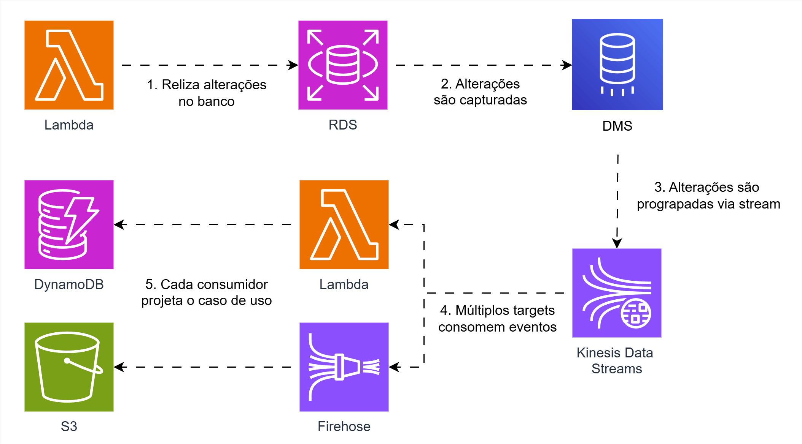

## Streaming de eventos do RDS via AWS Database Migration Service

Um padrão recorrente em arquiteturas orientadas a eventos é o Change Data Capture (CDC). A ideia do CDC é monitorar alterações em storages ou bancos de dados e reagir a operações de escrita, normalmente transmitindo esses eventos.

Alguns storages e bancos de dados já possuem essa solução nativamente, como o DynamoDB, que conta com Streams, e o S3, que oferece Event Notifications. Já alguns bancos de dados relacionais, não implementam essa funcionalidade de forma nativa, mas utilizam mecanismos como logs de operações que viabilizam o CDC.

Na AWS temos o Database Migration Service (DMS), uma ferramenta voltada para migração de dados, oferecendo full load para carregamento inicial e suporte ao CDC em alguns mecanismos de banco de dados, como PostgreSQL e MySQL, desde que estejam devidamente configurados.

Um dos bancos suportados para streaming de alterações via CDC na AWS é o RDS, solução gerenciada para bancos relacionais. No que se refere aos destinos, o DMS oferece diversas opções, incluindo o Kinesis Data Streams.

Com essa arquitetura, é possível capturar as alterações no RDS via DMS, enviá-las para o Kinesis, que pode distribuir os dados para múltiplos consumidores. 

## Arquitetura
