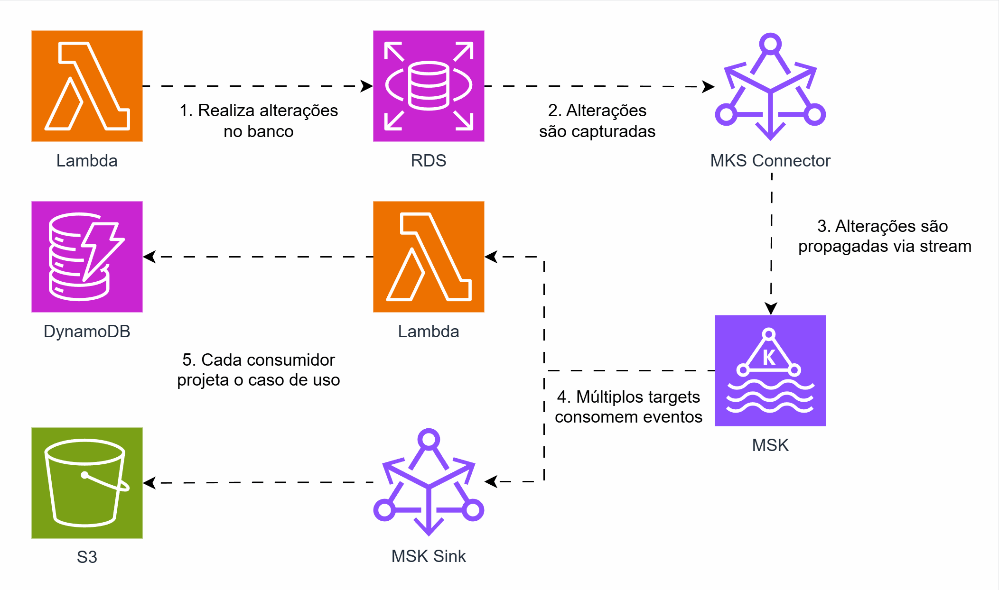

## Streaming de eventos do RDS via AWS MSK

Na última semana, fiz uma publicação sobre Streaming de eventos do RDS via AWS DMS. Porém, há várias formas de atingir o mesmo objetivo, e a "arquitetura ideal" depende da necessidade. Hoje, trago outra alternativa.

Recapitulando: CDC (Change Data Capture) é um padrão em arquiteturas orientadas a eventos para monitorar alterações em bancos de dados ou storages e transmitir essas mudanças. Algumas ferramentas já possuem essa solução de forma nativa, como é o caso do DynamoDB ou S3, outras te dão meios de implementa-las, como é o caso de PostgreSQL, MySQL e outros.
 
Uma solução na AWS para streaming de dados é o Managed Streaming for Apache Kafka (MSK), um Kafka gerenciado na AWS. Dentro do ecossistema Kafka, o Connect é uma solução que permite ouvir eventos e ler dados de algumas fontes, processa-los e enviá-los para alguns destinos, e no MSK temos esse mesmo recurso.

Nesta arquitetura, um conector do MSK escuta alterações, em um PostgreSQL por exemplo, no RDS e envia os eventos para um tópico. A partir dele, podemos direcionar os dados para múltiplos alvos, como: uma Lambda para processamento e armazenamento dos dados e/ou um conector sink para armazenar diretamente no S3.

## Arquitetura
