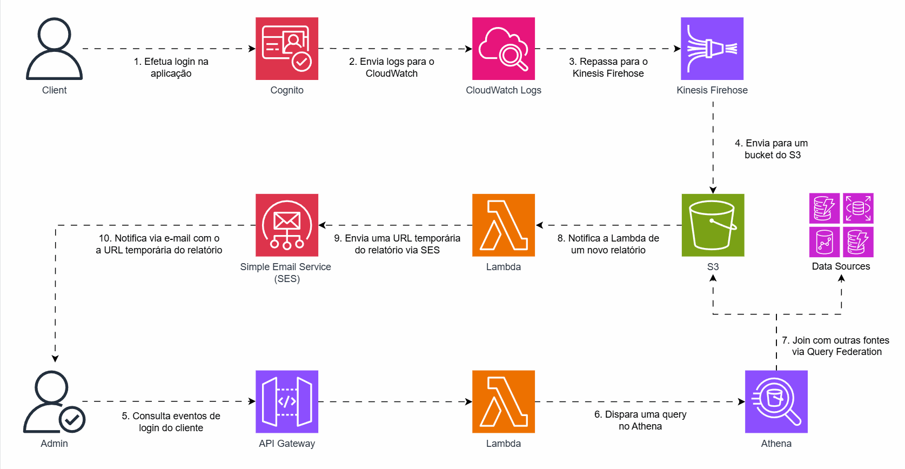

## Gerando Relatórios de Login de Clientes via AWS Cognito - V2

Para criar uma solução mais robusta, que permita consultas mais complexas e integre outras fontes de dados além dos logs do Cognito, temos a seguinte possibilidade:

### 1. Integração com S3 via Kinesis Firehose
Os logs do Cognito, armazenados no CloudWatch, podem ser enviados para o S3 utilizando o Kinesis Firehose. Isso possibilita o uso do Athena como ferramenta de consulta para os logs.

### 2. Query Federation com o Athena
O Athena oferece o recurso de Query Federation que permite executar joins com outras fontes de dados, como RDS, DynamoDB, Redshift e outras.

### 3. Notificações de novos relatórios via S3 
Ao utilizar o Athena precisamos considerar sua natureza assíncrona de resolução de queries, para isso conseguimos utilizar os Event Notifications do S3 para notificar uma Lambda, por exemplo, sobre novos relatórios disponíveis na plataforma. 

### 4. Comunicação com URL temporária
Com a Lambda podemos gerar uma URL temporária para o relatório no S3 e posteriormente encaminhar em algum canal de notificação, por exemplo via email utilizando o SES. 

## Arquitetura
