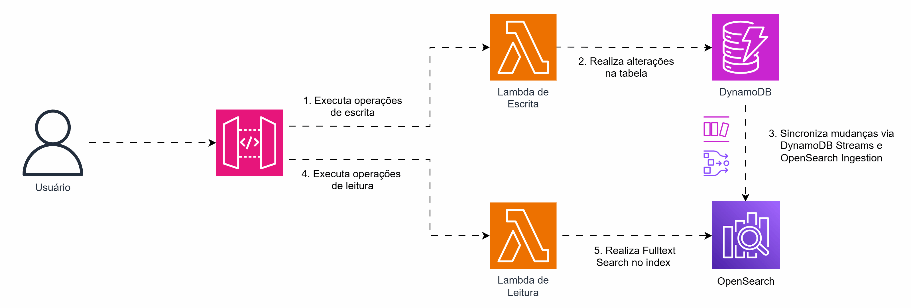

## CQRS + Full-Text Search na AWS com DynamoDB e OpenSearch

CQRS, ou Command Query Responsibility Segregation, é o processo de separar fluxos de leitura e escrita das aplicações. Esse padrão pode ser utilizado em diversos cenários, como para proporcionar escalabilidade horizontal, onde a aplicação escreve na base principal e lê de réplicas de leitura.

Outra oportunidade para aplicar o CQRS é quando a aplicação possui casos de leitura e escrita de natureza distintas, em que um único tipo de storage não atende da melhor maneira à demanda. Por exemplo, um banco de dados no modelo de documentos pode atender à maioria dos casos de uso de uma aplicação, mas pode carecer de recursos para execução de leituras full-text que outros bancos oferecem.

Na AWS, podemos utilizar o DynamoDB sincronizado com o OpenSearch para atender a essa necessidade. O DynamoDB possui o recurso de streams de alterações, enquanto o OpenSearch oferece o recurso de ingestion para carregamento de dados. Dessa forma, é possível automatizar a sincronização eventual entre as duas bases e realizar leituras de cada uma delas dependendo do caso de uso.

Neste caso se atente a necessidade de consistência eventual proposta pelo modelo.
## Arquitetura
