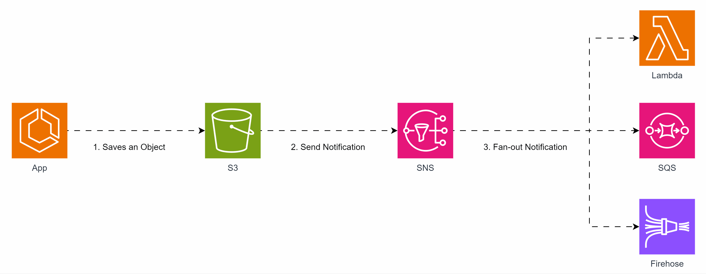

## Fan-out de eventos do S3

A AWS oferece recursos que facilitam a implementação de arquiteturas orientadas a eventos, como a capacidade de alguns serviços dispararem notificações quando certos eventos ocorrem.

O S3 é um desses serviços. Com o S3 Events Notification, é possível enviar notificações para destinos como SQS, SNS e Lambda sempre que eventos específicos acontecem no bucket.

Porém, em alguns cenários, é necessário processar essas notificações em diferentes demandas de negócio e em paralelo para aumentar o throughput. 

Utilizando o SNS, é possível implementar um fan-out, entregando o mesmo evento para vários subscribers, como Lambda, SQS e Kinesis Firehose. Dessa forma, cada subscriber pode atuar em uma demanda de negócio isolada, garantindo processamento paralelo e eficiente.

## Arquitetura
