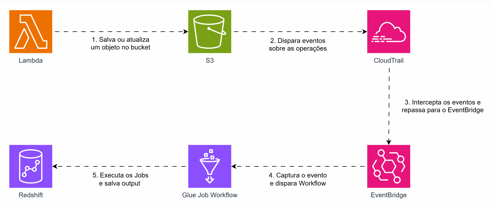

## Usando o AWS Glue em uma Arquitetura Baseada em Eventos

A automação de jobs ETL, a capacidade de descoberta e catalogação de dados, além de sua natureza serverless, tornam o AWS Glue uma peça importante no ecossistema de dados da AWS.

Por padrão, um Glue Job pode ser executado sob demanda, agendado ou após a execução de outro Job ou Crawler. Entretanto, com o recurso de Workflows, é possível habilitar a execução por meio do EventBridge.

Na arquitetura proposta, incluímos o Glue Job em um Workflow e configuramos um gatilho via EventBridge. Os eventos do bucket são enviados ao CloudTrail, que os repassa para o EventBridge. No EventBridge, criamos uma regra que aciona o Workflow do Glue.

## Arquitetura
