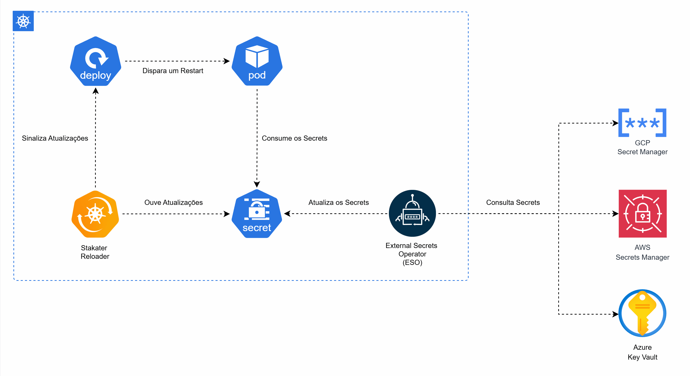

## Sobre os Secrets do Kubernetes
O Kubernetes oferece um recurso nativo para o armazenamento de segredos de aplicações: os Secrets. Eles funcionam de forma semelhante aos ConfigMaps, porém com algumas políticas adicionais de segurança.

No entanto, em muitas implementações de Kubernetes, práticas como criptografia em repouso, criptografia em trânsito e controles de acesso mais restritivos não são habilitadas por padrão e exigem configurações adicionais do cluster.

Para mitigar riscos e reduzir o esforço operacional de implementar boas práticas diretamente com Kubernetes Secrets, muitas empresas optam por utilizar Secrets Managers externos, como AWS Secrets Manager, Google Secret Manager, Azure Key Vault, entre outros, para armazenar os segredos de suas aplicações. 

Essa abordagem é válida, mas traz consigo alguns desafios.

### Desafio 1 - Custo
Imagine que um endpoint da sua aplicação precise de um secret para executar um caso de uso. Uma abordagem comum é, a cada requisição, consultar diretamente o Secrets Manager.

Essa estratégia garante que a aplicação sempre utilize a versão mais atualizada do segredo. Porém, soluções de Secrets Manager geralmente têm um modelo de custo baseado tanto na quantidade de segredos armazenados quanto no número de requisições de leitura.

Para aplicações com alto volume de tráfego, esse custo pode crescer rapidamente e se tornar um problema.

### Desafio 2 - Alto Acoplamento
Seguindo o mesmo exemplo de chamada por requisição, caso não exista um cache local e o segredo seja essencial para o funcionamento do caso de uso, uma indisponibilidade do Secrets Manager impactará diretamente a aplicação.

Nesse cenário, a disponibilidade do seu serviço passa a depender diretamente da disponibilidade do provedor externo de secrets.

### Desafio 3 - Lidando com Armazenamento ou Cache Local
Uma forma de mitigar os problemas de custo e alto acoplamento seria armazenar os segredos localmente. Por exemplo, durante o build ou deploy da aplicação, consultar o Secrets Manager e disponibilizar os valores via variáveis de ambiente.

O problema dessa abordagem é que qualquer atualização de um segredo exige um novo build e um novo deploy da aplicação.

Outra alternativa seria implementar um cache local na própria aplicação, após a primeira consulta ao Secrets Manager. Porém, isso transfere para a aplicação a complexidade de:

- Lidar com cache
- Definir estratégia de invalidação
- Orquestrar atualizações quando o segredo muda

Além de aumentar o acoplamento, esse modelo adiciona complexidade ao código e ao ciclo de vida da aplicação.

## Entra em Cena o External Secrets Operator (ESO)
O External Secrets Operator (ESO) é um operador, uma solução para estender as capacidades nativas do Kubernetes. Ele permite sincronizar segredos armazenados em Secrets Managers externos com o cluster Kubernetes.

O ESO implementa o padrão de controller do Kubernetes, utilizando um reconciliation loop para manter um Secret local sincronizado com sua fonte externa.

O ESO suporta diversos provedores, como AWS Secrets Manager, GCP Secret Manager, Azure Key Vault, Hashicorp Vault, entre outros. Além disso, oferece configurações para controlar o comportamento de sincronização, como a propriedade spec.refreshInterval, que define o intervalo entre as consultas ao Secrets Manager.

O recurso central do ESO é o ExternalSecret, que, ao ser reconciliado, cria ou atualiza um Kubernetes Secret, permitindo que ele seja consumido pela aplicação da mesma forma que um Secret nativo.

Para injeção dos dados, as opções são as mesmas dos Secrets tradicionais: variáveis de ambiente, parâmetros de execução do container ou arquivos.

O ESO não vem instalado por padrão na maioria das distribuições Kubernetes, mas pode ser facilmente instalado, por exemplo, via Helm chart.

### Desafio 4 - Lidando com Atualizações
Como mencionei, Secrets e ConfigMaps no Kubernetes podem ser disponibilizados via:

- Variáveis de ambiente
- Parâmetros de execução do container
- Arquivos montados em volumes

E apenas o modelo baseado em arquivos via volume suporta atualização automática sem recriação dos Pods. Porém, muitas aplicações são projetadas para ler configurações a partir de variáveis de ambiente carregadas em memória.

Migrar para o modelo de arquivos implica em:
- Adaptar a aplicação
- Criar e gerenciar volumes
- Ler via filesystem (que, em cloud, costuma ser uma chamada de rede abstraída)
- Impactar na latência das requisições

Agora a questão é: como manter uma aplicação lendo os segredos diretamente da memória, com baixa latência, e ainda assim receber atualizações sem processos manuais de deploy?

## Entra em Cena o Stakater Reloader
O Stakater Reloader, assim como o ESO, segue o Operator pattern do Kubernetes e implementa um controller que monitora mudanças em Secrets e ConfigMaps. Esse controller dispara rolling restarts em recursos como Deployments, StatefulSets, DaemonSets ou DeploymentConfigs associados.

Com isso, após o restart, os Pods passam a utilizar a versão atualizada do Secret, independentemente da forma de injeção utilizada.

O Reloader também pode ser instalado de diversas formas no cluster Kubernetes, e sua configuração é simples e baseada em labels.

## Proposta
Na arquitetura proposta, utilizamos o ESO para manter os Secrets do Kubernetes sincronizados com o Secrets Manager externo, controlando o intervalo de sincronização e a forma de disponibilização dos dados para as aplicações — neste caso, via variáveis de ambiente.

Para lidar com atualizações, utilizamos o Stakater Reloader, que dispara o restart das aplicações automaticamente em caso de atualização de Secret. Após a inicialização, cada Pod passa a ter o segredo atualizado carregado em memória, sem necessidade de intervenção manual.

Essa estratégia permite:
1. Controlar custos ajustando o número de requisições do ESO para o Secrets Manager
2. Reduzir o acoplamento com serviços externos com uma cópia local dos segredos
3. Tornar o processo totalmente transparente para a aplicação e automatizado
4. Possibilitar atualizações automáticas

## Arquitetura

## Considerações
Como toda solução, essa abordagem também possui trade-offs.

Entre uma atualização no Secrets Manager e a aplicação efetivamente utilizar o novo valor, existe um delay composto pelo:
- Intervalo de sincronização do ESO
- Tempo de atualização dos Pods

Esse impacto pode ser mitigado ajustando o intervalo de requisições do ESO e trabalhando com aplicações que possuem startup rápido.

Outro ponto importante é a necessidade de recriação dos Pods. Boas práticas de deploy, como:
- Connection draining
- Startup rápido
- Readiness e liveness probes bem configuradas
- Graceful shutdown

ajudam a reduzir impactos de disponibilidade e possíveis perdas de conexão em produção.

Sobre o uso de variáveis de ambiente, caso exista a necessidade de trabalhar com valores criptografados, é possível integrar com serviços como o AWS KMS, permitindo que os valores sejam descriptografados apenas no momento do uso.

## Quando Não Utilizar Esse Modelo
Apesar de ser uma arquitetura interessante e madura para produção, esse modelo não é a melhor escolha para todos os cenários. A seguir alguns exemplos:

### Necessidade de Atualização Imediata
Se o seu caso de uso exige que uma atualização de secret esteja disponível praticamente em tempo real, o modelo baseado em intervalo de atualização + rolling restart pode não atender esse requisito.

Nesses casos, pode ser necessário:
- A leitura direta do Secrets Manager
- Um mecanismo de cache com invalidação ativa

## Aplicações Stateful Sensíveis a Restart
Se a aplicação não tolera bem reinicializações, mesmo que controladas, esse modelo pode não é o mais adequado. Embora práticas como graceful shutdown e readiness probes ajudem bastante, aplicações altamente stateful ou com sessões longas podem exigir outro tipo de abordagem.

## Ambientes com Secrets Extremamente Voláteis
Se os segredos mudam com muita frequência (por exemplo, múltiplas vezes por minuto), o custo e o churn de Pods causados pelo Reloader podem ser maiores do que o benefício.

## Clusters Muito Pequenos ou Ambientes Simples
Em ambientes pequenos, com cworkloads simples, o custo operacional de manter ESO + Reloader pode não se justificar. Nestes casos, soluções mais simples podem ser suficientes.